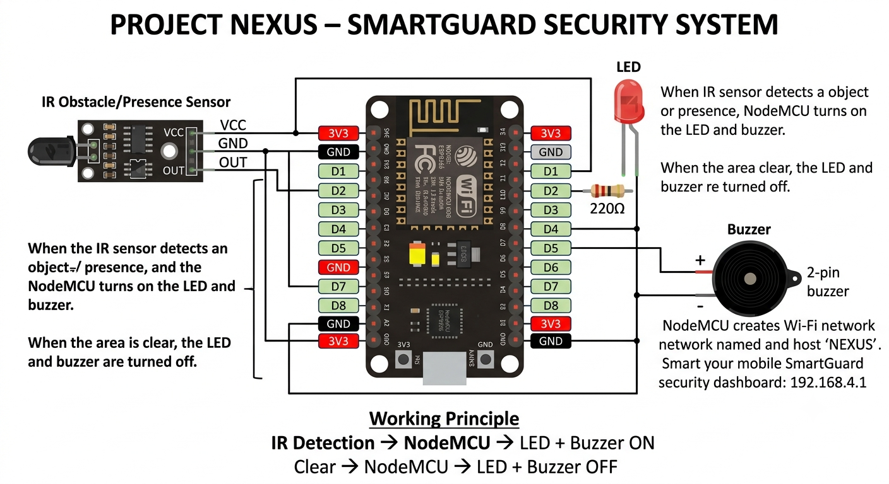

# 🛡️ SmartGuard Security System

A Wi-Fi-enabled safety and security alarm prototype built using an **ESP8266 NodeMCU**.

The system uses an IR sensor to detect nearby activity and automatically activates a warning LED and buzzer. A mobile-friendly web dashboard hosted directly by the ESP8266 allows the system status to be monitored from a phone connected to the NEXUS Wi-Fi network.

## 🚀 Current Version

**SmartGuard Security System**

### ✨ Features

- 📡 ESP8266-based controller
- 📱 Wireless phone connectivity
- 🌐 Built-in web dashboard
- 👁️ IR-based presence detection
- 🔴 Automatic warning LED
- 🚨 Automatic buzzer alarm
- 📊 Real-time security status
- 📱 Mobile-friendly SmartGuard interface

## ⚙️ How It Works

The IR sensor continuously monitors the surroundings.

### When activity is detected:

**IR Sensor → ESP8266 → LED ON + Buzzer ON**

The SmartGuard dashboard displays:

**SYSTEM STATUS: ALERT**

**PRESENCE: ACTIVITY DETECTED**

**WARNING LIGHT: ON**

**ALARM: ACTIVE**

### When the area is clear:

**IR Sensor → ESP8266 → LED OFF + Buzzer OFF**

The dashboard displays:

**SYSTEM STATUS: PROTECTED**

**PRESENCE: NO ACTIVITY**

**WARNING LIGHT: OFF**

**ALARM: STANDBY**

## 🔌 Hardware

| Component | Purpose |
|---|---|
| NodeMCU ESP8266 | Main controller |
| IR Sensor | Presence/object detection |
| LED | Visual warning |
| 220Ω resistor | LED current limiting |
| 2-pin buzzer | Audible alarm |
| Jumper wires | Connections |
| USB cable | Programming and power |

## 🔗 Pin Connections

| Component | NodeMCU |
|---|---|
| IR VCC | 3V3 |
| IR GND | GND |
| IR OUT | D2 |
| LED | D1 through resistor |
| LED GND | GND |
| Buzzer + | D5 |
| Buzzer − | GND |

## 🔧 Circuit Diagram

The circuit diagram below shows the complete hardware connections used in the SmartGuard security system.

## 📱 SmartGuard Dashboard

The ESP8266 creates its own Wi-Fi network:

**Network:** `NEXUS`

The phone connects directly to the ESP8266 and opens the SmartGuard dashboard at:

**192.168.4.1**

### 🟢 Protected Mode — No Activity Detected

When the area is clear, the system remains in protected mode.

**System Status:** PROTECTED  
**Presence:** NO ACTIVITY  
**Warning Light:** OFF  
**Alarm:** STANDBY

### 🔴 Alert Mode — Activity Detected

When the IR sensor detects activity, the warning LED and buzzer are activated.

**System Status:** ALERT  
**Presence:** ACTIVITY DETECTED  
**Warning Light:** ON  
**Alarm:** ACTIVE

## 🎥 Project Demonstration

The demonstration video shows the SmartGuard security system working in real time.

### Demonstration includes:

- ESP8266 system startup
- Phone connection to NEXUS
- SmartGuard dashboard
- IR presence detection
- LED activation
- Buzzer activation
- System returning to protected mode

**🎬 Project Demonstration:**  
[Watch the SmartGuard Security System](https://drive.google.com/file/d/1casWtIVbWK1bkiasmlR8LyNJOkoo86L4/view?usp=sharing)

## 🧠 Technology

- **Microcontroller:** ESP8266 NodeMCU
- **Programming:** Arduino C/C++
- **Communication:** Wi-Fi
- **Web Server:** ESP8266WebServer
- **Interface:** HTML + CSS
- **Sensor:** IR detection module

## 👨‍💻 Author

**Zaheed Khan**

### 🛡️ Project Name

**SmartGuard Security System**

---

